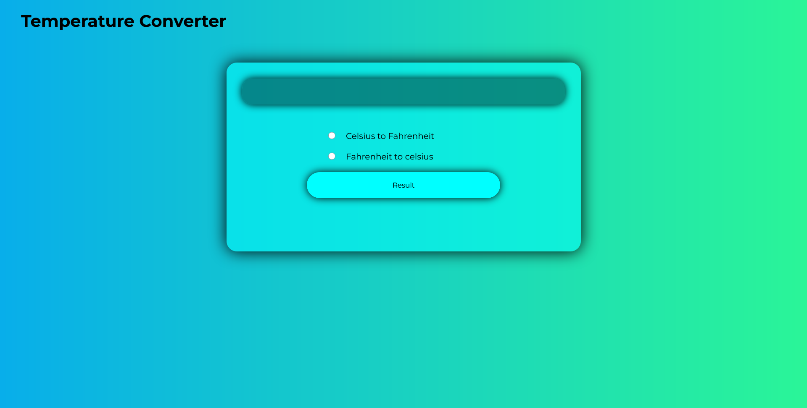

# 🌡️ Temperature Converter

A sleek and simple **Temperature Converter** built with **HTML, CSS, and JavaScript**!  
Easily convert between **Celsius and Fahrenheit** in just one click.  
Clean design, beginner-friendly logic, and responsive UI make this mini project a must-have in your portfolio 💻🔥

---

## 📸 Preview

 <!-- Replace with real image if you have -->

---

## 🎥 Project Demo

Check out the full video walkthrough on YouTube:  
👉 [Watch here](https://youtu.be/cAjuq6UEIdo)

---

## 🌐 Live Demo

Try it out instantly in your browser:  
👉 [Live Demo](https://rakesh12531.github.io/Temp_converter/)

---

## ✨ Features

- ✅ Convert Celsius to Fahrenheit & vice versa
- ✅ Simple and intuitive radio button selection
- ✅ Instant result display
- ✅ Fully responsive and clean UI
- ✅ Lightweight and fast loading

---

## 🛠️ Tech Stack

- **HTML** – for structure  
- **CSS** – for styling  
- **JavaScript** – for logic & interactivity  

---

## 🙋‍♂️ Author

**Rakesh Raj S**  
📧 Email: [rakeshraj12531@gmail.com](mailto:rakeshraj12531@gmail.com)  
🔗 LinkedIn: [linkedin.com/in/rakesh531](https://www.linkedin.com/in/rakesh531)  
🐙 GitHub: [github.com/rakesh12531](https://github.com/rakesh12531)

---

## 💡 Fun Fact

This was built in pure HTML/CSS/JS — no libraries, no frameworks. Just clean code and passion 🚀  
Feel free to fork it, play with it, or improve it! Contributions welcome 💬

---

## ⭐ Show Some Love

If you liked this project, don’t forget to ⭐ the repo and share it with your fellow devs!

